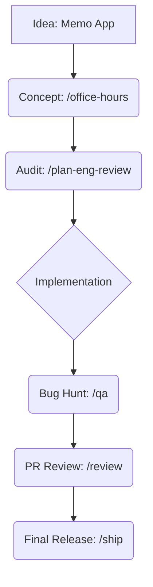

# gStack-Antigravity 🚀

[한국어 README](./README_KO.md)

**gStack-Antigravity** is a high-performance, team-ready port of [garrytan/gstack](https://github.com/garrytan/gstack) built natively for the **Antigravity** agent environment.

It brings the original gStack's elite developer workflows and browser automation to Antigravity with a **Thin Router** architecture that prioritizes token efficiency and cross-platform reliability.

---

## 🏗 Why this Port? (Core Philosophy)

Developing AI workflows often hits two bottlenecks: **Token Exhaustion** and **Execution Drift**. 

gStack-Antigravity solves these using:
- **Thin Router Architecture**: Instead of loading 30,000+ tokens of logic every session, we use lightweight rules (`.agents/rules/`) that act as routers. They pull the exact "Source of Truth" from `gstack-origin/` only when a specific command is invoked.
- **Native Browser Integration**: We use Antigravity's native `browser_subagent` and `read_browser_page` tools as a first-class bridge, ensuring faster, more visual feedback.
- **Cross-Platform Parity**: Specialized support for macOS, Linux, and Windows (PowerShell).

---

## 🚀 Getting Started

### 1. End Users (Recommended)
The fastest way to add gStack powers to your project:
```bash
# MUST be run in your project's root directory:
npx @runchr/gstack-antigravity
```
Then, open Antigravity in your project and **enter `/gstack-setup` in the chat window**:
```bash
/gstack-setup
```

### 2. Contributors & Developers
If you want to modify gStack-Antigravity or sync with upstream:
```bash
git clone https://github.com/runchr-com/gstack-antigravity.git
cd gstack-antigravity
/gstack-setup
```

> [!NOTE]
> The `/gstack-setup` command is essential because it builds platform-specific browser binaries (which cannot be pre-bundled in npm).

---

## 🛠 Workflow Command Reference (`/commands`)

Antigravity workflows allow you to run complex, multi-step agent behaviors with a single command.

| Command | Category | Description |
|:--- |:--- |:--- |
| `/office-hours` | **Strategy** | Brainstorming session for new ideas. Focuses on product-market fit and user pain. |
| `/plan-ceo-review` | **Strategy** | Strategic challenge of your current plan. Asks the "hard questions" about scope and value. |
| `/plan-eng-review` | **Architecture** | Rigorous technical audit of your implementation plan. Checks for race conditions, auth, and edge cases. |
| `/autoplan` | **Strategy** | Runs CEO, Design, and Eng reviews sequentially in one session. |
| `/investigate` | **Debugging** | Systematic root-cause debugging. **Iron Law: No fixes without root cause.** |
| `/qa` | **Testing** | Automated browser-driven QA. Discovers targets, finds bugs, and offers auto-fixes. |
| `/review` | **Audit** | Pre-landing PR review. Pass 1 (Critical issues), Pass 2 (Code quality). |
| `/ship` | **Release** | The ultimate ship engine: Merge -> Test -> Eval -> Version -> Changelog -> Push -> PR. |
| `/codex` | **Review** | Request a "Second Opinion" from an adversarial model to find hidden exploits. |

---

## 📖 Example Scenario: Building a "Memo App" from A to Z

How do you actually use these commands? Let's walk through building a simple Memo App.



### 1. Dreaming & Strategy (`/office-hours`)
- **User**: "I want to build a memo app with voice recognition and tagging."
- **Antigravity**: Runs a brainstorming session to clarify the MVP features and user pain points.
- **Outcome**: A solid product spec and prioritized task list.

### 2. Architecture Audit (`/plan-eng-review`)
- **User**: "Here is my plan for the database schema and sync logic."
- **Antigravity**: Reviews the plan for race conditions, auth gaps, and edge cases.
- **Outcome**: A "hardened" implementation plan that is ready for coding.

### 3. Automated Quality Guard (`/qa`)
- **User**: "Make sure the 'Delete Note' button works on both mobile and desktop."
- **Antigravity**: Spawns a headless browser, navigates to your local dev server, finds the button, and verifies the deletion in the database.
- **Outcome**: Discovers a UI bug on mobile and provides an automatic fix.

### 4. Zero-Friction Release (`/ship`)
- **User**: "I'm ready to push this to production."
- **Antigravity**: Checks tests, updates the version, generates a changelog, creates a PR, and merges it once approved.
- **Outcome**: Your feature is live, documented, and versioned—without a single manual git command.

---

## 🌐 Browser Automation ($B)

For manual control or technical integration, use the `$B` (browse) command set. These tools use a persistent headless Chromium instance.

### Common Patterns
- **Orientation**: `$B goto [URL]` -> `$B snapshot -i` (Highlights all interactive elements).
- **Interaction**: `$B click @e1`, `$B fill @e2 "value"`.
- **Assertion**: `$B is visible ".dashboard"`, `$B console` (Check JS errors).
- **Evidence**: `$B screenshot`, `$B snapshot -a -o [path]` (Annotated capture).

### Command List
- `goto <url>`: Navigate to target.
- `snapshot -i`: Interactive accessibility tree with `@e` refs.
- `snapshot -D`: Unified diff against previous page state.
- `responsive`: Capture mobile, tablet, and desktop views at once.
- `cookie-import-browser`: Import real login sessions from your Chrome/Arc/Edge.
- `handoff`: Open visible Chrome for user takeover (CAPTCHA, etc.).

---

## 🛡 Security & Safety

- **Local Only**: All session state, screenshots, and logs are kept in `.gstack/` (ignored by git).
- **`/careful`**: Activates guardrails for destructive commands (rm -rf, DROP TABLE, force push).
- **`/guard`**: Maximum safety mode (read-only restrictions for specific modules).

---

## 🛠 Troubleshooting & Corporate Networks

If you are using gStack-Antigravity in a restricted corporate environment (Firewall/Proxy), you may encounter `ECONNRESET` errors during browser downloads.

### 1. Corporate Proxy
If your network requires a proxy, set the `HTTPS_PROXY` environment variable before running setup:
```bash
HTTPS_PROXY=http://your-proxy-server:8080 /gstack-setup
```

### 2. Skipping Browser Download (Token Efficiency)
To save tokens and avoid repeated download failures, you can run the setup without the browser installation:
```bash
/gstack-setup --skip-browser
```
This will build the core `browse` binary and register skills, but skip the Playwright Chromium download.

### 3. Manual Browser Installation
If the automated download fails, run this command manually in a standard terminal:
```bash
npx playwright install chromium
```

---

## 🔄 Upstream Sync
To sync with the original `garrytan/gstack` source:
```bash
./scripts/sync-gstack-origin.sh
```

## 📄 License
MIT License. Created by [garrytan](https://github.com/garrytan), ported to Antigravity by [runchr](https://github.com/runchr-com).
