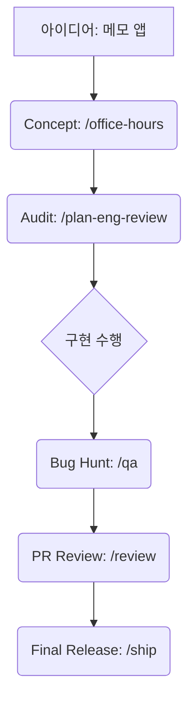

# gStack-Antigravity 🚀

[English README](./README.md)

**gStack-Antigravity**는 [garrytan/gstack](https://github.com/garrytan/gstack)의 강력한 에이전트 워크플로우와 브라우저 자동화를 **Antigravity** 환경에 맞게 네이티브로 이식한 고성능 팀용 포트입니다.

토큰 효율성을 극대화한 **Thin Router** 아키텍처와 **표준 준수형 전역 엔진(Shared Engine)** 방식을 통해 최상의 AI 협업 경험을 제공합니다.

---

## 🏗 왜 이 포트가 필요한가요? (핵심 철학)

AI 워크플로우 개발은 보통 두 가지 병목 현상에 부딪힙니다: **토큰 과소비**와 **실행 일관성 부재** 

gStack-Antigravity는 이를 다음과 같이 해결합니다:
- **Thin Router 아키텍처**: 모든 로직을 프로젝트마다 복사하는 대신, 가벼운 규칙(`.agents/rules/`)만 로컬에 둡니다. 무거운 엔진은 전역 공간에서 공유되어 효율적입니다.
- **표준 준수 및 격리**: 안티그래비티 표준 저장소(`~/.gemini/antigravity/skills`)를 사용하며, 프로젝트별 작업 로그(`.gstack/`)는 철저히 격리됩니다.
*   **네이티브 브라우저 통합**: Antigravity의 네이티브 `browser_subagent` 도구를 일급 브리지로 사용하여 시각적으로 빠르고 정확한 피드백을 제공합니다.
*   **크로스 플랫폼 지원**: macOS, Linux, Windows(PowerShell) 등 모든 환경에서 동일한 경험을 하도록 보정되었습니다.

---

## 🚀 시작하기

### 1. 전문가 및 일반 사용자 (권장)
가장 빠르고 간편한 설치 방법입니다. 한 번의 실행으로 전역 엔진 설치와 프로젝트 초기화가 동시에 완료됩니다:
```bash
# 반드시 프로젝트의 루트 디렉토리에서 실행하세요:
npx @runchr/gstack-antigravity
```
설치 후 Antigravity를 열고, **AI가 프로젝트를 인식하고 환경을 최종 점검할 수 있도록** 채팅창에 명령어를 입력하세요:
```bash
/gstack-setup
```

### 2. 개발자 및 전역 설치 선호자
엔진을 컴퓨터에 미리 깔아두고 여러 프로젝트에서 공유하려는 경우:
```bash
# 전역 설치
npm install -g @runchr/gstack-antigravity

# 새 프로젝트에서 초기화
cd my-new-project
gstack-antigravity init
```

> [!TIP]
> **표준 저장소 사용**: 이 패키지는 안티그래비티 표준에 따라 `~/.gemini/antigravity/skills/gstack`에 엔진을 보관합니다. 공유 엔진을 사용하므로 두 번째 프로젝트부터는 설치와 `/gstack-setup`이 **즉시(Instant)** 완료됩니다.

---

## 🛠 워크플로우 명령어 가이드 (`/commands`)

Antigravity 워크플로우를 사용하면 복잡한 다단계 작업을 단 하나의 명령어로 실행할 수 있습니다.

| 명령어 | 카테고리 | 설명 |
|:--- |:--- |:--- |
| `/office-hours` | **전략** | 새로운 아이디어를 위한 브레인스토밍. 제품-시장 적합성(PMF)과 사용자 통점(pain point)에 집중합니다. |
| `/plan-ceo-review` | **전략** | 현재 계획에 대한 전략적 도전. 범위와 가치에 대해 "까다로운 질문"을 던집니다. |
| `/plan-eng-review` | **아키텍처** | 구현 계획에 대한 기술적 감사. 레이스 컨디션, 보안, 예외 상황 등을 점검합니다. |
| `/autoplan` | **전략** | CEO, 디자인, 엔지니어링 리뷰를 한 세션에서 순차적으로 실행합니다. |
| `/investigate` | **디버깅** | 체계적인 원인 분석 기반 디버깅. **철칙: 원인 규명 없이는 수정도 없습니다.** |
| `/qa` | **테스트** | 자동 브라우저 QA. 대상을 탐색하고 버그를 찾아 자동 수정까지 제안합니다. |
| `/review` | **감사** | 코드 리뷰. 1단계(치명적 이슈), 2단계(코드 품질/스타일)로 나누어 수행합니다. |
| `/ship` | **배포** | 머지 -> 테스트 -> 평가 -> 버전업 -> 변경이력 -> 푸시 -> PR 생성을 자동화합니다. |
| `/codex` | **검증** | 숨겨진 버그나 보안 취약점을 찾기 위해 적대적 모델(Adversarial)의 제2의 의견을 구합니다. |

---

## 📖 활용 시나리오 예시: 메모 앱 만들기 (A to Z)

gStack-Antigravity 명령어를 실제 개발에서 어떻게 활용할까요? 간단한 "메모 앱"을 만드는 과정을 통해 살펴보겠습니다.



### 1. 아이디어 구체화 & 전략 수립 (`/office-hours`)
- **사용자**: "음성 인식과 태그 시스템이 포함된 메모 앱을 만들고 싶어."
- **Antigravity**: 브레인스모팅 세션을 실행하여 MVP(최소 기능 제품)의 핵심 기능과 사용자 고충을 명확히 정의합니다.
- **결과**: 견고한 제품 상세 명세서와 우선순위가 정해진 작업 목록 도출.

### 2. 아키텍처 감사 (`/plan-eng-review`)
- **사용자**: "데이터베이스 스키마와 동기화 로직은 이렇게 설계했어."
- **Antigravity**: 레이스 컨디션, 보안 공백, 예외 케이스 등을 점검하여 설계상의 결함을 미리 찾아냅니다.
- **결과**: 코딩 준비가 완료된 "강화된(Hardened)" 구현 계획 확정.

### 3. 자동화된 품질 관리 (`/qa`)
- **사용자**: "노트 삭제 버튼이 모바일과 데스크톱에서 모두 제대로 작동하는지 확인해줘."
- **Antigravity**: 헤드리스 브라우저를 실행하고, 로컬 개발 서버에 접속하여 버튼 위치를 찾고, 데이터베이스에서 삭제가 실제로 일어나는지 검증합니다.
- **결과**: 모바일 UI에서의 클릭 버그를 발견하고 자동 수정을 제안.

### 4. 무결점 배포 (`/ship`)
- **사용자**: "이제 완벽해. 이 기능을 실제 서버에 배포할 준비가 됐어."
- **Antigravity**: 테스트를 실행하고, 버전을 업데이트하고, 변경 이력(Changelog)을 생성한 뒤, PR을 만들고 승인되면 메인으로 머지합니다.
- **결과**: 단 한 번의 수동 git 명령 없이 기능 배포, 문서화, 버전 관리가 완료됩니다.

---

## 🌐 브라우저 자동화 ($B)

수동 제어나 기술적 통합이 필요한 경우 `$B` (browse) 명령어를 사용하세요.

### 주요 패턴
- **탐색**: `$B goto [URL]` -> `$B snapshot -i` (모든 대화형 요소를 하이라이트).
- **상호작용**: `$B click @e1`, `$B fill @e2 "값"`.
- **검증**: `$B is visible ".dashboard"`, `$B console` (JS 에러 확인).
- **증거**: `$B screenshot`, `$B snapshot -a -o [경로]` (주석이 달린 스크린샷).

### 주요 명령어 리스트
- `goto <url>`: 대상 사이트 이동.
- `snapshot -i`: `@e` 참조번호가 포함된 대화형 접근성 트리 출력.
- `snapshot -D`: 이전 페이지 상태와 현재 상태의 차이(Diff) 출력.
- `responsive`: 모바일, 태블릿, 데스크탑 뷰를 한 번에 캡처.
- `cookie-import-browser`: 실제 브라우저(Chrome/Arc/Edge)의 로그인 세션을 가져옵니다.
- `handoff`: 복잡한 본인인증(MFA/CAPTCHA)을 위해 사용자에게 브라우저를 넘깁니다.

---

## 🛡 보안 및 안전

- **로컬 중심**: 모든 세션 상태, 스크린샷, 로그는 워크스페이스 내의 `.gstack/`에 보관됩니다 (Git 제외).
- **`/careful`**: 위험한 명령어(`rm -rf`, `DROP TABLE` 등) 실행 시 사용자 확인을 강제합니다.
- **`/guard`**: 특정 모듈에 대해 읽기 전용 제약을 거는 최대 안전 모드를 활성화합니다.

---

## 🛠 기업망 및 네트워크 트러블슈팅

방화벽이나 프록시가 설정된 기업 내부 네트워크 환경에서는 브라우저 다운로드 중 `ECONNRESET` 에러가 발생할 수 있습니다.

### 1. 기업 프록시 설정
네트워크에서 프록시 서버를 사용하는 경우, 다음과 같이 `HTTPS_PROXY` 환경 변수를 프록시 서버 주소로 설정한 후 실행하세요:
```bash
HTTPS_PROXY=http://your-proxy-server:8080 /gstack-setup
```

### 2. 브라우저 다운로드 건너뛰기 (토큰 절약)
네트워크 문제로 설치가 반복 실패하여 토큰이 낭비되는 것을 방지하기 위해, 브라우저 다운로드를 제외한 핵심 설정만 먼저 완료할 수 있습니다:
```bash
/gstack-setup --skip-browser
```
이 옵션은 `browse` 바이너리 빌드와 스킬 등록은 수행하지만, Playwright Chromium 다운로드는 건너뜁니다.

### 3. 수동 브라우저 설치
자동 다운로드가 실패한 경우, 별도의 터미널(Antigravity 밖)에서 다음 명령어를 실행하여 수동으로 설치하세요:
```bash
npx playwright install chromium
```

---

## 🔄 업스트림 동기화 (Sync)
원본 `garrytan/gstack` 소스와 동기화하려면 다음을 실행하세요:
```bash
./scripts/sync-gstack-origin.sh
```

## 📄 라이선스
MIT 라이선스. [garrytan](https://github.com/garrytan)에 의해 생성되었으며, [runchr](https://github.com/runchr-com)에 의해 Antigravity로 포팅되었습니다.
